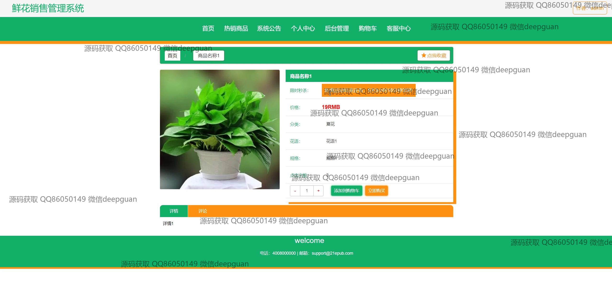
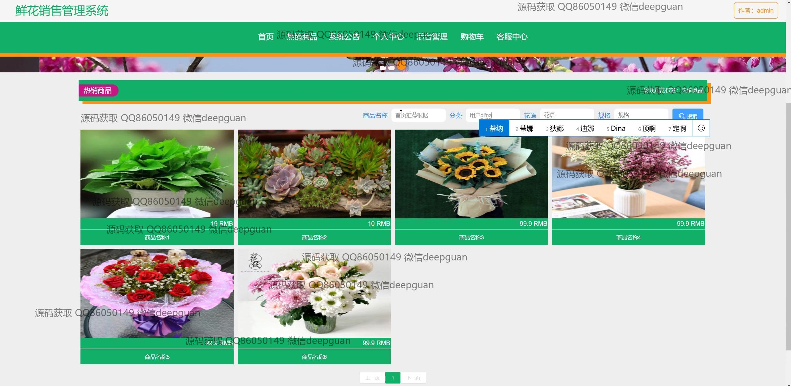
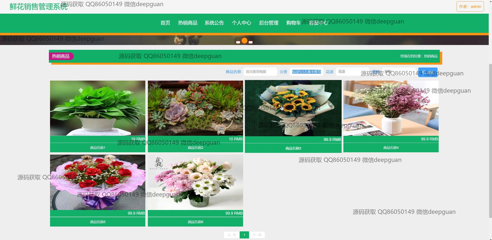
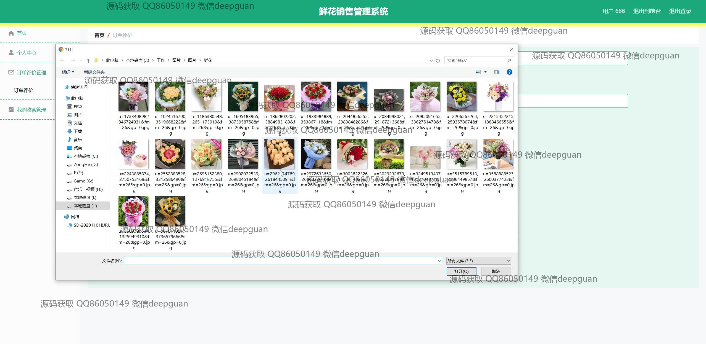

<h1 align="center">的鲜花销售管理系统vue</h1>

## 简介
鲜花销售管理系统：角色分为管理员和用户；支持用户注册、信息管理、商品管理、订单评价；功能包括销售统计、用户管理、客服交互、系统公告。    --计算机毕业设计源码；毕设源码；java毕业设计源码

## 联系方式

<h3 align="center">获取完整代码与数据库文件 + 微信：deepguan QQ: 86050149 QQ群: 783742310</h3>

<h3 align="center">可帮忙远程部署 包运行成功！提供远程部署、修改代码、设计文档指导、代码讲解等服务！</h3>

## 功能介绍（完整见运行截图）
管理员： 管理员可以通过登录界面进行登录和退出操作，进入系统后可以访问首页、个人中心、订单评价管理、收藏管理、商品管理、和用户管理等功能模块。可在商品管理中添加、编辑或删除商品，上传商品图片，设置商品分类和倒计时，在用户管理中查看、修改或删除用户信息。管理员还可以管理系统公告、订单、及进行销售统计，以便全面掌握系统运作，并进行后台管理设置。

用户： 用户通过注册界面注册账户，填写用户名、密码、邮箱等信息后可访问系统。用户可以浏览首页中展示的热销产品，查看商品详情，选择商品数量并加至购物车或直接购买。个人中心模块为用户提供了修改个人信息、管理收货地址、查看订单和收藏商品的功能。用户还可以通过系统提供的联系信息或客服中心进行咨询与沟通，以便获取更好的服务体验。

## 运行截图

本代码来源于网络,仅供学习参考使用!

